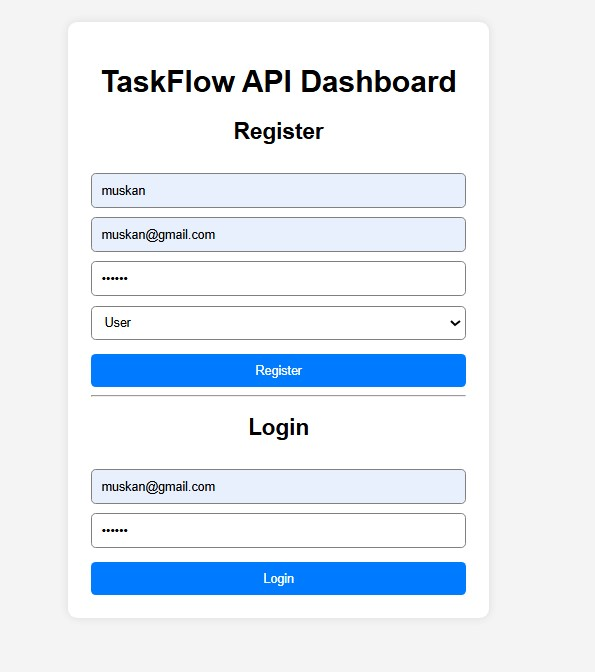
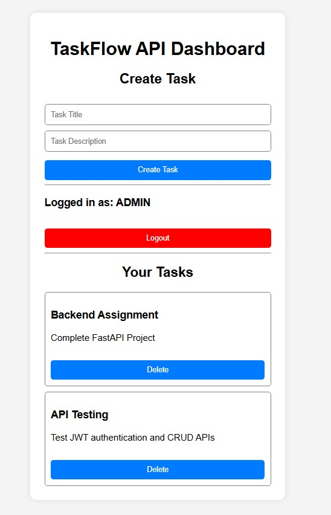
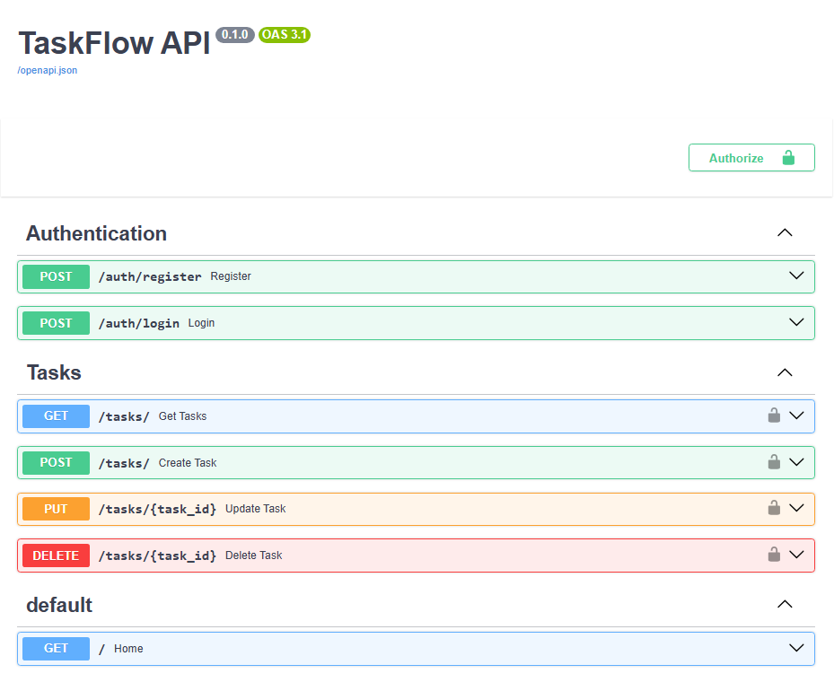

# TaskFlow API

TaskFlow API is a full-stack task management system built using FastAPI, SQLite, JWT authentication, role-based access control, and Vanilla JavaScript frontend.

---

# Features

## Authentication
- User Registration
- User Login
- JWT Authentication
- Password Hashing using Passlib

## Role-Based Access Control
- User Role
- Admin Role
- Admin-only Task Deletion

## Task Management
- Create Tasks
- View Tasks
- Update Tasks
- Delete Tasks
- User-specific Tasks

## Frontend
- Vanilla JavaScript Frontend
- Login & Registration UI
- Task Dashboard
- Logout Functionality
- Role Display

## Security
- JWT Token Authentication
- Password Validation
- Protected Routes
- Input Validation

---

# Tech Stack

## Backend
- FastAPI
- SQLAlchemy
- SQLite
- JWT Authentication
- Passlib

## Frontend
- HTML
- CSS
- Vanilla JavaScript

---

# Project Structure

```text
TaskFlow-API/

│

├── app/

│   ├── auth/

│   ├── models/

│   ├── routes/

│   ├── schemas/

│   ├── utils/

│   ├── database.py

│   └── main.py

│

├── frontend/

│   ├── index.html

│   ├── style.css

│   └── script.js

│

├── screenshots/

│   ├── auth-page.jpg

│   ├── dashboard.jpg

│   └── swagger-docs.png

│

├── app.db

├── requirements.txt

├── .gitignore

└── README.md
```

---

# Installation Guide

## Clone Repository

```bash
git clone https://github.com/muskan1766/taskflow-api.git
```

---

# Backend Setup

## Create Virtual Environment

```bash
python -m venv venv
```

---

## Activate Virtual Environment

### Windows

```bash
.\venv\Scripts\Activate
```

---

## Install Dependencies

```bash
pip install -r requirements.txt
```

---

## Run Backend Server

```bash
uvicorn app.main:app --reload
```

Backend Server:

```text
http://127.0.0.1:8000
```

Swagger Documentation:

```text
http://127.0.0.1:8000/docs
```

---

# Frontend Setup

Open:

```text
frontend/index.html
```

using Live Server or browser.

---

# API Endpoints

## Authentication
- POST `/auth/register`
- POST `/auth/login`

## Tasks
- GET `/tasks/`
- POST `/tasks/`
- PUT `/tasks/{task_id}`
- DELETE `/tasks/{task_id}`

---

# Project Screenshots

## Authentication Page



---

## Dashboard



---

## Swagger API Documentation



---

# Scalability Notes

This project follows a modular architecture for scalability and maintainability.

Possible future improvements:
- PostgreSQL Integration
- Docker Deployment
- Redis Caching
- Microservices Architecture
- Load Balancing
- CI/CD Pipeline

---

# Author

Muskan 